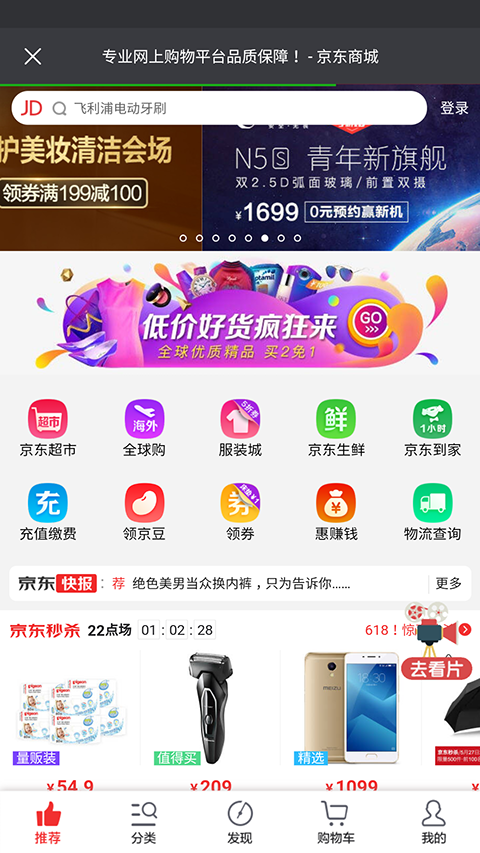

### [README of English](./README_ENGLISH.md)

## AgentWeb 介绍
AgentWeb 是一个高度封装的 Android WebView ，简单易用 ， 带有进度条 、 支持文件上传 、 下载 、 简化 Javascript 通信 、 链式调用 、 加强 Web 安全的库 。让你几行代码集成一个小型浏览器在你的应用 。更多使用请参照上面的 sample 。 [AgentWeb App 功能](./agentweb.apk)

## 前言 
WebView 可谓是每个应用必备的一个控件了 ，但是谈起它的使用 ，让很多人都不是那么喜欢它 ，比如说每个 Web 页面都需要各种一大推的 setting ，好一点的可能封装成一个 BaseWebActivity 和 BaseWebFragment ，但是重复的代码总是让有洁癖的程序员不舒服 ，而且 WebView 本身功能也不是很完善 ， AgentWeb 就泥补了这些空缺 。

## 引入


* Gradle 
   
   ```
   compile 'com.just.agentweb:agentweb:1.1.1'
   ```
* Maven
	
	```
	<dependency>
 	  <groupId>com.just.agentweb</groupId>
 	  <artifactId>agentweb</artifactId>
	  <version>1.1.1</version>
	  <type>pom</type>
	</dependency>
	
	```


## AgentWeb 功能
1. 支持进度条以及自定义进度条
2. 支持文件下载
3. 支持文件下载断点续传
4. 支持下载通知形式提示进度
5. 简化 Javascript 通信 
6. 支持 Android 4.4 Kitkat 以及其他版本文件上传
7. 支持注入 Cookies
8. 加强 Web 安全
9. 兼容低版本 Js 安全通信
10. 更省电 。

## 为什么要使用 AgentWeb ？

|     Web     |  文件下载  |  文件上传 |   Js 通信  |  断点续传  |   使用简易度 |  进度条      | 线程安全    |
|:-----------:|:---------:|:---------|:---------|:---------|:----------- |:-----------|:-----------|
| WebView     |  不支持    | 不支持		|  支持    |     不支持 |    麻烦      | 没有        | 不安全      |
| AgentWeb	 |  支持		| 支持		|  更简洁   |   支持    |    简洁      | 有         |  安全       |	


## 简洁易用
#### 为什么说它简洁易用吗 ？ 下面京东效果图 ， 只需一句话 ！

```
mAgentWeb = AgentWeb.with(this)//传入Activity
                .setAgentWebParent(mLinearLayout, new LinearLayout.LayoutParams(-1, -1))//传入AgentWeb 的父控件 ，如果父控件为 RelativeLayout ， 那么第二参数需要传入 RelativeLayout.LayoutParams
                .useDefaultIndicator()// 使用默认进度条
                .defaultProgressBarColor() // 使用默认进度条颜色
                .setReceivedTitleCallback(mCallback) //设置 Web 页面的 title 回调
                .createAgentWeb()//
                .ready()
                .go("http://www.jd.com");

```
里面没有一句 Setting ， 甚至连 WebChromeClient 都不用配置就有进度条 。 


## 效果图 



#### Javascript 通信拼接太麻烦 ？ 请看 。

```
//Javascript 方法
function callByAndroid(){
      console.log("callByAndroid")
  }


```
Android 端

`mAgentWeb.getJsEntraceAccess().quickCallJs("callByAndroid");`

结果
```
consoleMessage:callByAndroid  lineNumber:27
```

#### 事件处理

```
@Override
    public boolean onKeyDown(int keyCode, KeyEvent event) {

        if (mAgentWeb.handleKeyEvent(keyCode, event)) {
            return true;
        }
        return super.onKeyDown(keyCode, event);
    }

```

#### 跟随 Activity Or Fragment 生命周期 ， 释放 CPU 更省电 。

```
	@Override
    protected void onPause() {
        mAgentWeb.getWebLifeCycle().onPause();
        super.onPause();

    }

    @Override
    protected void onResume() {
        mAgentWeb.getWebLifeCycle().onResume();
        super.onResume();
    }

```

#### 文件上传处理

```
@Override
    protected void onActivityResult(int requestCode, int resultCode, Intent data) {
        mAgentWeb.uploadFileResult(requestCode, resultCode, data);
        super.onActivityResult(requestCode, resultCode, data);
    }

```

#### 到了这里 ， 弱弱问一句 ， 你还有什么理由不使用 AgentWeb ？


## 混淆
如果你的项目需要加入混淆 ， 请加入如下配置

```
-keep class com.just.library.** {
    *;
}
-dontwarn com.just.library.**

```
Java 注入类不要混淆 ， 例如 App 里面的 AndroidInterface 对象 ， 需要 Keep 。

```
-keepclassmembers class com.just.library.agentweb.AndroidInterface{ *; }
```


## 致谢
* [360 大牛 SafeWebView](https://github.com/seven456/SafeWebView)

* [WebView 参考文献](https://juejin.im/post/58a037df86b599006b3fade4)

## 总结
AgentWeb 是一个把 WebView 完全代理出来 ， 脱离 Activity 、 Fragment xml 布局 ， 独立的 Android Web 库 。


### 最后如果该库对你有帮助不妨对右上角点点 Star 对我支持 ， 感谢万分 ! 当然我更喜欢你 Fork PR 成为项目贡献者 . [AgentWeb](https://github.com/Justson/AgentWeb)
	
	

	  


   

