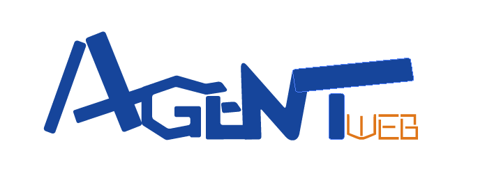
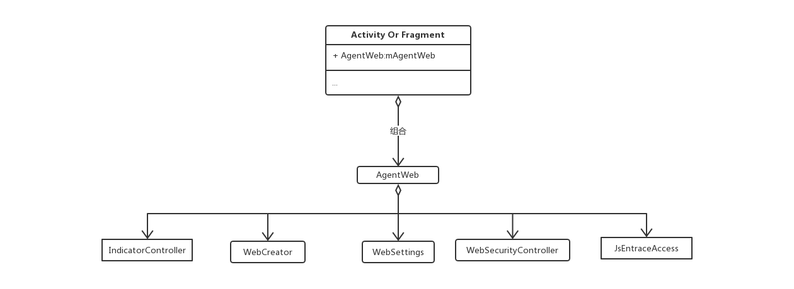

### [README of Chinese](./README.md)

## AgentWeb Introduce
AgentWeb is an open souce library for Android web , extremely easy to be used ，has progress bar 、 upload or download file 、 simplify Javascript communication 、  chain call 、 strengthen the Web security library 。A little bit of code can integration this framework into your application 。 [download app](./agentweb.apk)

## Preface 
WebView can be described as a necessary control for each application but may be not many people like it，couse too many settings ，Maybe you will encapsulation into your BaseWebActivity or BaseWebFragment ， but it reusability is too low ,And WebView itself is not very perfect function， AgentWeb makes up for these vacancies 。

## AgentWeb function
1. Support progress bar and custom progress bar
2. support file downloads
3. Support file download breakpoint resume
4. Download notification form prompts progress
5. simplify Javascript communication 
6. Support Android 4.4 Kitkat or other version to upload file
7. inject Cookies
8. strengthen the Web security 
9. Compatible with low version Js secure communication

## Why you need AgentWeb ？

|     Web     |  download files  |  upload files |   Js comnunication  |  breakpoint  |   Ease of use |  indicator      | Thread safe  |
|:-----------:|:---------:|:---------|:---------|:---------|:----------- |:-----------|:-----------|
| WebView     |  not support    | not support|  support    |     not support|    trouble      | No        | unsafe     |
| AgentWeb	 |  support		| support	|  More concise   |   support    |    easy      | Have         |  safe       |	


## Use is very simple
why？ The following Jingdong renderings, just a word ！

```
mAgentWeb = AgentWeb.with(this)//传入Activity
                .setAgentWebParent(mLinearLayout, new LinearLayout.LayoutParams(-1, -1))// incoming AgentWeb parent view ，if parent view is RelativeLayout ， else second params is RelativeLayout.LayoutParams
                .useDefaultIndicator()// use default indicator
                .defaultProgressBarColor() // use default indicator color
                .setReceivedTitleCallback(mCallback) //set Web page'title callback
                .createAgentWeb()//
                .ready()
                .go("http://www.jd.com");

```
ok right ，nothing about web Setting abave ， Even the WebChromeClient does not have a progress bar。 

Javascript comnunication concat trouble ？ fllowing 。

```
//Javascript mothed
function callByAndroid(){
      console.log("callByAndroid")
  }


```
Android 

`mAgentWeb.getJsEntraceAccess().quickCallJs("callByAndroid");`

result
```
consoleMessage:callByAndroid  lineNumber:27
```


## Renderings


#### To here  ， Weak and weak one sentence ， Do you have any reason not to use  AgentWeb ？


## Progress bar
Why do you have to talk about the progress of this thing? Because there is no progress of the WebView page experience is really bad, AgentWeb default progress bar is the general browser progress bar, why use this progress bar? Because of good experience, WeChat and QQ, Alipay, UC and Safari are using this progress bar is their reason, I have seen the application to load the Web page when the direct play Dialog can not be canceled, there is no need for users to determine the situation are not playing Dialog, especially in the user Network is not the case, the loading speed becomes surprisingly slow, then Dialog has been there, the user patience is not good, can only kill your process.


## Agentweb view structure

```
  <FrameLayout
        android:layout_width="match_parent"
        android:layout_height="match_parent">

        <WebView
            android:layout_width="match_parent"
            android:layout_height="match_parent">

        </WebView>
		 <!--进度条-->
        <com.just.library.BaseIndicatorView
            android:layout_width="match_parent"
            android:layout_height="2dp"
            >

        </com.just.library.BaseIndicatorView>
    </FrameLayout>

```

The outermost layer of AgentWeb is FrameLayout, so when you use AgentWeb, you need to specify the parent control for FrameLayout (see below) 。


## AgentWeb Internal structure



* IndicatorController Progress bar controller
* WebCreator create WebView 
* WebSettings Uniform settings WebView 's settings
* WebSecurityController Safety controller
* JsEntraceAccess  Js method entry


## Download


* Gradle 
   
   ```
   compile 'com.just.agentweb:agentweb:1.2.0'
   ```
* Maven
	
	```
	<dependency>
 	  <groupId>com.just.agentweb</groupId>
 	  <artifactId>agentweb</artifactId>
	  <version>1.2.0</version>
	  <type>pom</type>
	</dependency>
	
	```

## Usage

Activity , How to use ? as follows

```
mAgentWeb = AgentWeb.with(this)
                .setAgentWebParent(mLinearLayout, new LinearLayout.LayoutParams(-1, -1))
                .useDefaultIndicator()
                .defaultProgressBarColor() 
                .setReceivedTitleCallback(mCallback) 
                .createAgentWeb()//
                .ready()
                .go("http://www.jd.com");

```	

Fragment , How to use ? as follows

```
  @Override
    public void onViewCreated(View view, @Nullable Bundle savedInstanceState) {
        super.onViewCreated(view, savedInstanceState);
        mAgentWeb = AgentWeb.with(this)
                .setAgentWebParent((ViewGroup) view, new LinearLayout.LayoutParams(-1, -1))                .useDefaultIndicator()
                .setReceivedTitleCallback(mCallback) 
                .setSecurityType(AgentWeb.SecurityType.strict)
                .createAgentWeb()//
                .ready()//
                .go(getUrl());
        
    }

```

## ProGuard

If you are using ProGuard you might need to add the following option: 

```
-keep class com.just.library.** {
    *;
}
-dontwarn com.just.library.**


```
 Java injection class do not ProGuard, such as App inside AndroidInterface object, need Keep.

```
-keepclassmembers class com.just.library.agentweb.AndroidInterface{ *; }
```


## Thanks
* [seven456  SafeWebView](https://github.com/seven456/SafeWebView)

* [WebView References](https://juejin.im/post/58a037df86b599006b3fade4)

## Summary
AgentWeb is a complete proxy out of the WebView, from the Activity, Fragment xml layout, independent of the Android Web library.


### Finally, if the library for your help may wish to point to the upper right point Star support for me, thanks! Of course, I prefer you Fork PR become a project contributor.[AgentWeb](https://github.com/Justson/AgentWeb)
	
	

	  


   

